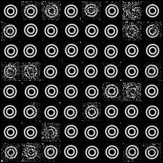
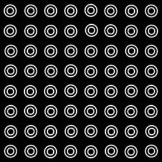
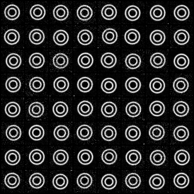

# Autonomous Diffusion

A modular framework for testing **noise-agnostic (autonomous) diffusion models** across multiple noise scheduling policies. The key innovation is decoupling the denoising network from explicit noise-level conditioning, enabling flexible policy switching and ODE-based sampler control.

## Motivation

Traditional diffusion models explicitly condition on noise level (via time embeddings, noise embeddings, or schedules). This framework tests whether models can learn robust denoising dynamics **without** noise-level information, then adapt to different sampling policies post-hoc via the unified policy interface.

## Current Features

### Core
- **Unified Policy Framework**: Swap between diffusion model types:
  - **DDPM** - Classical diffusion model.
  - **EDM** - Elucidating the design space of diffusion-based generative models.
  - **Flow Matching (FM)** - velocity flow alignment.
  - **EQM** - Equilibrium matching.
  
- **Noise-Agnostic Models**: Train models that ignore time/noise conditioning, apply any policy at inference time.
  - `NoiseAgnosticSmallUNet` - UNet without time embedding or FiLM layers.
  - Time-conditioned variants (`SmallUNet`, `TimeMLP`) for comparison.

### Infrastructure
- **Config-Driven Training & Sampling**: Fully reproducible experiments via YAML.
- **Class-Name Instantiation**: Register models and datasets by class name, no branching logic.
- **Multiple Solvers**: Euler and Heun ODE solvers for sampling speed/quality trade-offs.
- **PyTorch Datasets**: Standardized dataset classes for seamless batching.

### Supported Datasets
- `ConcentricCirclesDataset` - 2D synthetic (32×32 images).
- `OneDGaussianDataset` - Mixture of Gaussians (1D scalar).
- Extensible to MNIST, CIFAR-10, etc.

## Quick Start

### Train a Model

```bash
python -m scripts.train --config configs/concentric_circles.yaml
```

### Sample from Checkpoint

```bash
python -m scripts.sample --checkpoint train-log/concentric_circles_1/model-final.pt --n-samples 64
```
<!-- 
## Config Example

```yaml
data:
  type: ConcentricCirclesDataset
  n_samples: 4096
  image_size: 32
  radii: [0.35, 0.65]
  thickness: 0.05
  noise: 0.03
  center_jitter: 0.08

model:
  type: NoiseAgnosticSmallUNet  # or SmallUNet for time-conditioned
  in_channels: 1
  base_dim: 64

diffusion:
  model_type: EQM  # or DDPM, EDM, FM

training:
  batch_size: 128
  learning_rate: 1e-4
  num_steps: 1000
  save_and_sample_every: 50
  sample_size: 64
  device: cuda

sampling:
  n_steps: 100
  solver: euler  # or heun
  stochastic: false
  eta: 1.0
  t_min: 1e-3

seed: 42
experiment_name: "concentric_circles"
```

## Project Structure

```
autonomous_diffusion/
├── models.py              # SmallUNet, NoiseAgnosticSmallUNet, TimeMLP
├── dataset.py             # ConcentricCirclesDataset, OneDGaussianDataset
├── unifed_diffusion.py    # UnifiedDiffusion and Trainer
├── model_policies.py      # Policy registry: DDPM, EDM, FM, EQM
├── utils.py               # Config I/O, data generation, helpers
├── helper.py              # NN building blocks
├── scripts/
│   ├── train.py           # Training entry point
│   └── sample.py          # Sampling/inference entry point
├── configs/               # YAML experiment configs
├── tests/                 # Unit and smoke tests
└── README.md              # This file
``` -->

## Roadmap

### Phase 1: Core (Current)
- Unified policy framework (DDPM, EDM, FM, EQM).
- Noise-agnostic model variants.
- Config-driven training and sampling.
- Multiple solvers (Euler, Heun).

### Phase 2: Blind ODE Traversal & Control (In Progress)
- **Blind ODE Traversal**: Pause/resume denoising mid-trajectory without explicit timestep tracking.
- **Trajectory Interpolation**: Blend between multiple sampled ODE paths.
- **Adaptive Sampling**: Dynamically adjust solver steps based on trajectory curvature or prediction confidence.
- **Checkpoint & Restore**: Save/load model state at arbitrary ODE times for transfer learning.

### Phase 3: Dataset & Model Expansion (Next)
- Add real datasets: MNIST, CIFAR-10, CelebA-HQ (32×32).
- Expand model: deeper UNets, Vision Transformers, DiT variants.
- Conditional generation: class, text-guided diffusion (optional).
- Lightweight models for edge deployment.

### Phase 4: Evaluation & Analysis (Future)
- Quantitative metrics: FID, IS, precision, recall, coverage.
- Autonomous policy search via RL or Bayesian optimization.
- Comparative ablations: noise-agnostic vs. time-conditioned, solver efficiency.
- Per-policy sampling curves and compute trade-offs.
<!-- 
### Phase 5: Autonomous Policy Learning (Research)
- Train a policy controller to select optimal sampler hyperparameters (solver, steps, eta).
- Reward function design: sample quality vs. compute budget.
- Multi-objective optimization: latency, memory, FID. -->

## Key Concepts

### Unified (a, b, c, d) Schedule
All policies represent diffusion dynamics via four coefficient functions:
- **a(t)**, **b(t)** control the signal and noise blend over time.
- **c(t)**, **d(t)** parameterize the drift and diffusion terms.

This abstraction allows transparent policy switching.

### Noise-Agnostic Models
Models trained **without** time embeddings or noise conditioning. Instead:
- Input only the noisy sample **x_t**.
- Rely on learned implicit priors over trajectory structure.
- Apply any policy's sampling procedure at inference.

### Sampling Stability Visualization

<!-- i have 3 images ddpm.png, edm.png, fm.png showing samples after training for 1000 steps using autonomous mode, write it in readme: -->

Samples generated by a noise-agnostic model trained on the concentric circles dataset, using different policies at inference time:
| DDPM (Unstable) | EDM (Stable) | Flow Matching (Inherently Stable) |
|-------------|------------|---------------------|
|  |  |  |

<!-- 
## Contributing

To add a new policy:
1. Subclass `BaseModelPolicy` in `model_policies.py`.
2. Implement `schedule(t)` returning `(a, b, c, d)`.
3. Register in `POLICY_REGISTRY`.
4. Add a config example in `configs/`.

To add a dataset:
1. Subclass `torch.utils.data.Dataset` in `dataset.py`.
2. Implement `__len__`, `__getitem__`, and expose `sample_shape`.
3. Reference by class name in config `data.type`. -->

## References

- **The Geometry of Noise**: [Why Diffusion Models Don't Need Noise Conditioning](https://arxiv.org/abs/2602.18428)
- **DDPM**: [Denoising Diffusion Probabilistic Models](https://arxiv.org/abs/2006.11239)
- **EDM**: [Elucidating the Design Space of Diffusion-Based Generative Models](https://arxiv.org/abs/2206.00364)
- **Flow Matching**: [Flow Matching for Generative Modeling](https://arxiv.org/abs/2210.02747)
<!-- 
## License

MIT License - see [LICENSE](LICENSE) for details. -->
